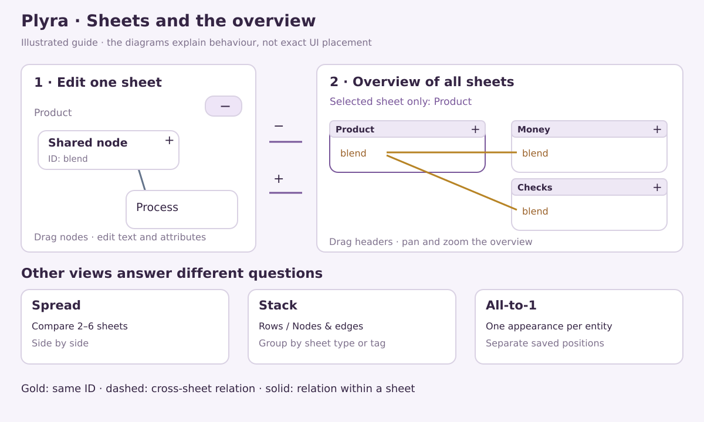
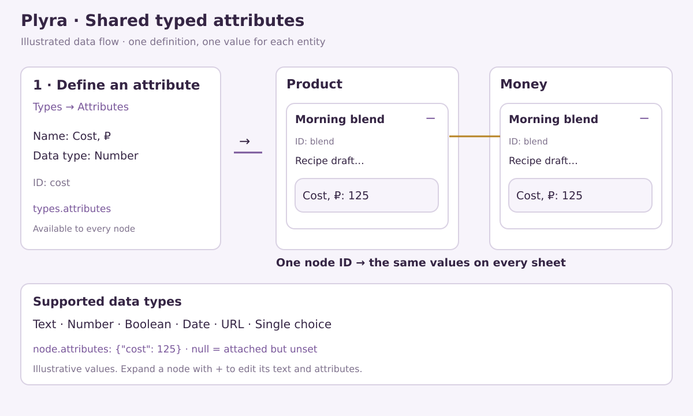
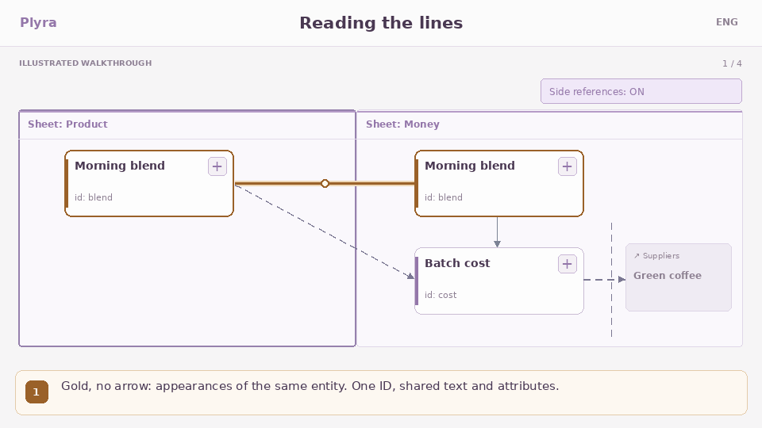

# Plyra

Knowledge maps on connected sheets. An entity has one ID, shared text and typed attributes; its appearances have independent positions and basic notation geometry.

**English** · [Русский](README.ru.md)

**0.7.0-rc.4** · [Live demo](https://elpiti-matt.github.io/Plyra/) · [Documentation](docs/README.md) · [Project format](docs/FORMAT.md) ·

## Open

Download `demo/index.html` and open it in a browser. The HTML is self-contained and uses no external assets. Save `.plyra` for continued editing. Pages publication is a separate manual action, so the live demo may lag behind the source version.

## Available features

| Feature | Behaviour |
| --- | --- |
| **Sheets** | Edit one sheet, drag nodes, expand their text and attributes with plus |
| **Helicopter view** | Use the upper-right minus to see all sheets; drag headers, pan/zoom, and open a sheet with its plus |
| **Selected sheet only** | Show cross-sheet relations and direct gold links to every shared appearance of the selected sheet; click another header to change focus |
| **Spread** | Compare 2–6 selected sheets side by side with adjustable proportions |
| **Stack** | Rows / Nodes & edges, all nodes of selected sheets, type/tag grouping and independent view optimization |
| **All-to-1** | One editable appearance per entity with separate saved positions |
| **Contents** | Sheet structure as a diagram or list |
| **Sheet types and tags** | Editable dictionaries and sheets; one type and multiple tags per sheet |
| **Node types** | Plyra, Flowchart, Obsidian Canvas, basic BPMN and custom definitions; notation shapes without decorative glyphs |
| **Relation types** | Text relationships such as depends on and inherits from |
| **Attributes** | Shared definitions and node values: text, number, boolean, date, URL and single choice |
| **Display settings** | Independent Select all / Turn off all for node and relation types; unchecked types dim in place |
| **Diagram imports** | Add draw.io, JSON Canvas and BPMN DI sheets after a limitations preview |
| **Project checks** | Help → Check project reports structure and membership findings |
| **Compatible data** | Legacy JSON, nodes.csv / edges.csv and built-in examples |
| **Project editing** | Empty projects, native open/save, projection exports, undo/redo, autosave and layout optimization |
| **AI and help** | Plyra v3 prompt and JSON example with attributes, RU/ENG FAQ; no external AI integration required |

*Original instructional diagram, not a browser screenshot. Sheet positions and node positions are independent. Dragging a node within a sheet does not transfer its membership.*

*Define an attribute under Types → Attributes, then attach a value to a node. The diagram uses fictional values.*

## Reading connections

*Illustrated walkthrough from Help. [Still image](src/assets/help/lines-en.png). Solid lines stay within a sheet, dashed lines cross sheets, and gold lines connect appearances of one ID. All-to-1 uses the original memberships.*

## Import scope

`.plyra` opens a complete project. draw.io, JSON Canvas and BPMN DI imports append sheets after preview, retaining coordinates, sizes and basic shapes. draw.io and BPMN retain route points. Imported figures remain editable and connect across sheets.

Complex shapes, groups, markers and text styling may be simplified. Images, attachments, backgrounds and external file content are not loaded. BPMN requires DI; direct Miro backup import is unavailable. These importers do not promise universal 1:1 fidelity. Solid local lines normalize notation styling; relation types and labels retain meaning, but the result is not strict BPMN/UML visual notation.

Native `.plyra` retains project data; draw.io and Canvas exports are projections. Limits: 10 MiB combined input/decompressed data, 100 sheets, 1,000 entities, 5,000 relations, 200 definitions per dictionary. Sheet and All-to-1 positions are saved. Filters, overview camera and stack layout settings last for the session.

## Development and validation

Node 22.12+: `npm ci`, `npm run dev`. Run `npm test` and `npm run build`; use `npm run ai:docs` to regenerate AI prompts and examples from application code.

98 model/DOM tests pass. [Validation](docs/VALIDATION.json) records the build and its limits.

[MIT](LICENSE). Dependency attribution is embedded in the HTML and `THIRD_PARTY_NOTICES.txt`.
