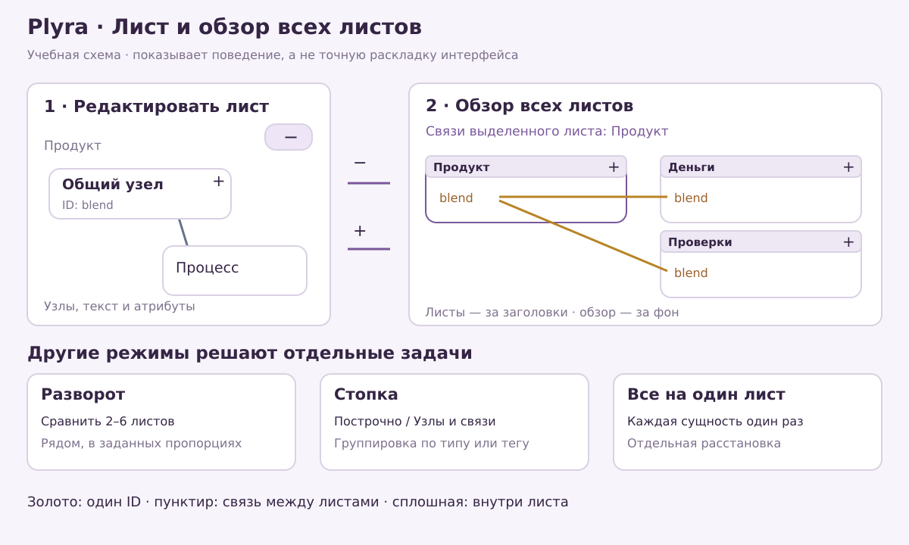
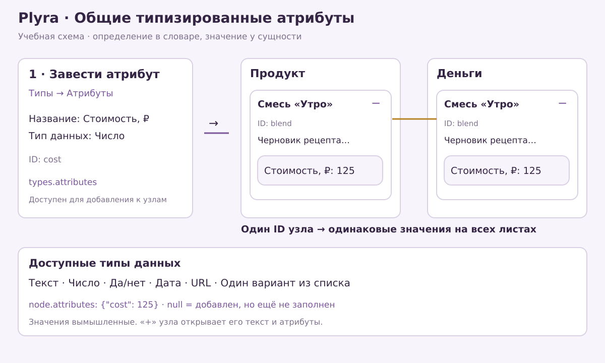
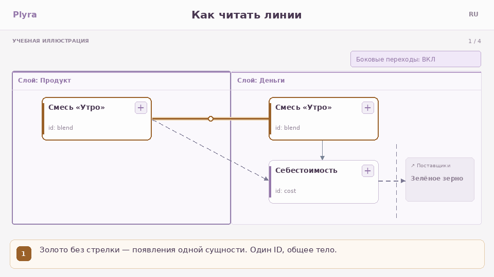
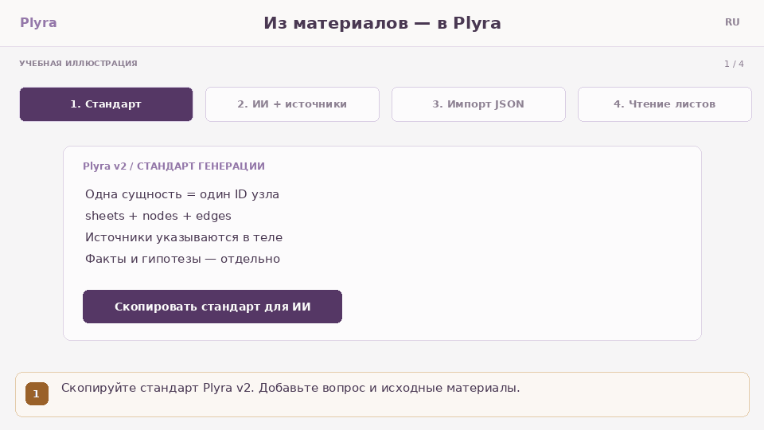

# Возможности Plyra 0.7.0-rc.4

[README](../README.ru.md) содержит полный перечень возможностей. Ниже — как ими пользоваться. Все картинки здесь учебные: они объясняют поведение, но не воспроизводят интерфейс пиксель в пиксель.

## Выбрать подходящий режим

| Задача | Режим и действие |
| --- | --- |
| Подробно редактировать диаграмму | **Листы**: двигать узлы, выбирать их, раскрывать через «+» |
| Посмотреть весь проект | **− Все листы** в правом верхнем углу редактора |
| Переставить лист целиком | В обзоре тянуть за заголовок; внутренние координаты узлов сохраняются |
| Переставить узел в обзоре | Тянуть сам узел; движение ограничено его листом и не меняет другие появления |
| Вернуться к редактированию | **+** в углу нужного листа |
| Сравнить несколько диаграмм | **Разворот**: выбрать 2–6 листов и пропорции |
| Рассмотреть структуру по слоям | **Стопка**: «Построчно» или «Узлы и связи», группировка по типу/тегу |
| Увидеть каждую сущность один раз | **Все на один лист**: отдельные сохраняемые позиции, общие текст и атрибуты |
| Перейти по структуре проекта | **Оглавление**: схема или список |

Для обзора используйте фон и колесо для перемещения, нижние кнопки или Ctrl/⌘ + колесо для масштаба. Два пальца тоже меняют масштаб. **Вписать все листы** возвращает весь проект в поле зрения. Масштаб обзора сохраняется при переходах «− / +» в текущем сеансе.

## Оставить только связи нужного листа

В обзоре включите **Только для выделенного листа** и нажмите заголовок листа. Его название появится над обзором. Все листы и их внутренние связи остаются на месте; межлистовые связи, не затрагивающие выбранный лист, скрываются.

**Между листами** управляет обычными межлистовыми отношениями. **Один ID** — золотыми линиями между появлениями одной сущности. При включённом фокусе золотые линии идут от выбранного листа ко всем остальным появлениям этого ID. Снятие отметки «Только для выделенного листа» возвращает общий обзор связей. Эти настройки не меняют данные проекта.

## Типы, теги и фильтры

В **Типы → Листы** сначала находятся теги, затем типы листов, затем сами листы. В каждом разделе можно добавить запись. У листа один тип и несколько тегов. Они помогают классифицировать листы и группировать стопку; тип листа не запрещает никаких типов узлов или связей.

В **Показ** есть две независимые пары кнопок: **Выбрать все / Выключить все** для типов узлов и для типов связей. Можно выключить все и затем отметить только нужные. «Выключить» здесь означает приглушить: узлы и линии остаются на месте, состав карты и экспорт сохраняются. Общая кнопка **Показать все типы** сбрасывает обе группы.

## Атрибуты: определение и значение

1. Откройте **Типы → Атрибуты**. Добавьте определение, например «Стоимость, ₽», выберите **Число**, сохраните типы.
2. Выберите узел. В его свойствах добавьте этот атрибут и задайте значение. Можно раскрыть узел кнопкой **+** и сделать это рядом с текстом.
3. Найдите тот же ID на другом листе: значение общее. Координаты появлений остаются независимыми.
4. Скачайте `.plyra`, чтобы сохранить определения и значения вместе с картой. Правки атрибутов участвуют в отмене/повторе.

| Тип данных | Пример значения | Что учитывать |
| --- | --- | --- |
| Текст | «Проверить источник» | Краткая заметка или описание |
| Число | `125.5` | Единицы лучше указать в названии определения |
| Да/нет | `true` или `false` | Незаданное значение отличается от «нет» |
| Дата | `2026-09-09` | Корректная календарная дата |
| URL | `https://example.com` | Ссылка с http/https |
| Список вариантов | «Черновик» | Один вариант из заданного списка |

В JSON определения лежат в `types.attributes`, значения — в `attributes` узла. `null` означает «атрибут добавлен, значение не задано»; отсутствие ключа — «атрибут к узлу не добавлен». Значения в таблице — примеры синтаксиса, не сведения о вашем проекте.

## Связи и импортированные диаграммы

*[Открыть неподвижную иллюстрацию](../src/assets/help/lines-ru.png). Золотые линии не являются отдельными отношениями: они выводятся из членств одного ID.*

Внутри листа все отношения сплошные, между листами пунктирные. Текстовый тип связи передаёт смысл: «зависит от», «наследует от», «реализует» и другие. Собственные типы создаются в **Типы → Связи**; штрих линии там не настраивается.

Импорт draw.io, JSON Canvas и BPMN DI добавляет листы после предпросмотра. Базовые формы, размеры и позиции сохраняются; у draw.io/BPMN также сохраняются точки маршрутов. Можно редактировать импортированные узлы и связывать их с другими листами. Прямого импорта Miro нет. Сложные фигуры, группы, маркеры и оформление могут упрощаться; [FORMAT](FORMAT.md) описывает ограничения. Сплошные линии меняют визуальные соглашения BPMN/UML, поэтому для смысла важны тип и подпись.

## Подготовить проект с ИИ

*[Неподвижная иллюстрация](../src/assets/help/ai-ru.png). Работа с ИИ проходит во внешнем сервисе по выбору пользователя.*

В **Справка → Подготовить проект с ИИ** скопируйте стандарт v3, допишите вопрос и исходные материалы. Сохраните ответ в `.plyra` или `.json` и откройте через **Проект**. Перед применением проверьте предпросмотр, после — факты, источники и неизвестные значения. Неправильные ссылки, типы и атрибуты отклоняют импорт целиком.

[Промпт RU](AI-PROMPT.ru.txt) · [Промпт EN](AI-PROMPT.en.txt) · [Пример RU](../data/ai-example-ru.json) · [Пример EN](../data/ai-example-en.json). Оба примера показывают шесть типов атрибутов, типы/теги листов и один ID на нескольких листах. Файлы генерируются из того же кода, что встроенная справка.

## Дополнительные инструменты

**Проект → Другие форматы и примеры** открывает CSV и встроенные учебные карты. Пара `nodes.csv` / `edges.csv` описывает узлы и связи; старый JSON также читается. **Справка → Проверить проект** показывает замечания к структуре и членствам. Текст узлов поддерживает безопасное подмножество Markdown.

## Сохранение и ограничения

Автосохранение хранит текущую карту в браузере. Файл `.plyra` нужен для переноса между устройствами и резервной копии. draw.io/Canvas — представления, которые не сохраняют всю модель Plyra. Камера, фильтры и раскладка стопки относятся к сеансу; расположение листов, узлов и All-to-1 входит в `.plyra`.

Оптимизация листа и разворота меняет их координаты; отмена возвращает прежние. Оптимизация стопки меняет только её вид, All-to-1 — его отдельные позиции. В обзоре есть вписывание всех листов; автоматической расстановки целых листов пока нет.

Лимиты проекта: 100 листов, 1 000 сущностей, 5 000 связей, 200 определений на словарь, 10 МиБ входных/распакованных данных. Поддержка импорта базовая, а не универсальная 1:1. [Проверки и их границы](VALIDATION.json) · [Ручная приёмка](QA-MANUAL.md).
