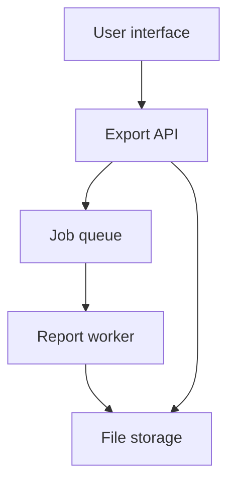
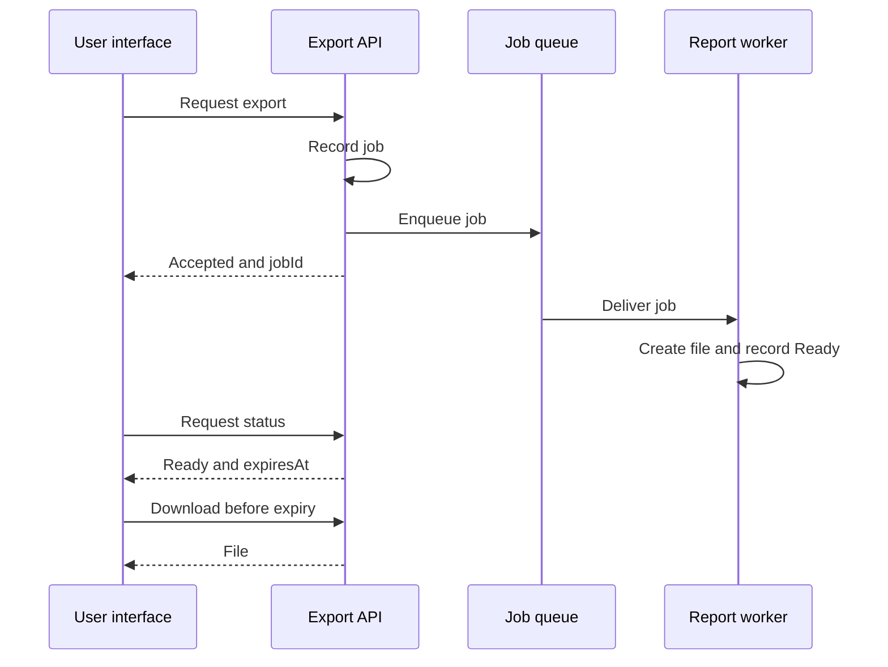
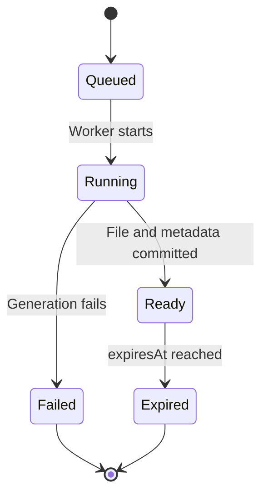

# Teaching artifacts: asynchronous report export

[Walkthrough](README.md) · [Разбор на русском](README.ru.md)

These are invented design artifacts, not production documentation. They share the identifiers used in the Plyra graph. All timings are assumptions; no backend is included. Mermaid renders these sources on compatible Markdown viewers. Plyra currently displays their descriptions as cards.

## API-01: contract excerpt

| Operation | Teaching contract |
|---|---|
| `POST /exports` | Accept parameters and a retry key; return `jobId` after recording the job |
| `GET /exports/{id}` | Return state; a ready result includes `expiresAt` |
| `GET /exports/{id}/file` | Authorize the owner and check expiry before allowing a download |

Named errors: `NotFound` for an unknown job or another owner; `NotReady`; `Expired`; `Conflict` for different parameters with the same retry key. Retry-key retention is a separate policy from file availability. This table is not a complete OpenAPI document.

## diagram.context: components

Job metadata is shared by the API and worker. The diagram isolates the delivery path; recording a job and reliably handing it to the queue needs its own design. No infrastructure provider has been chosen.

## diagram.sequence: observable flow

The API exposes persisted job state. The worker's result publication includes both the file reference and readiness metadata. The diagram omits ownership checks and failure handling to show one successful path; those remain requirements.

## diagram.states: job lifecycle

`Expired` means the availability period has ended. Physical cleanup can lag behind access revocation. A failed job is terminal in this minimal model; requesting another job is a separate action.

## fragment.expiry: reusable content

A completed file is available for 24 hours after the job finishes. Submit a new request after it expires.

The graph's user guide and runbook reference this one component. This Markdown copy is a static example: editing a Plyra node does not synchronize this file.

## assembly.review: proposed composition

| Order | Component ID | Purpose |
|---|---|---|
| 1 | `doc.brief` | Scope and purpose |
| 2 | `usecase.export` | User-visible behavior |
| 3 | `contract.export` | API agreement |
| 4 | `fragment.expiry` | Availability wording |
| 5 | `trace.matrix` | Planned verification |

A future publisher would resolve references at selected revisions, check missing components and cycles, apply ordering and produce Markdown or HTML. Ordinary graph links and sheet coordinates do not supply those rules on their own.

## CHG-01: exercise

Propose two hours for newly generated files. Trace the affected requirement, expiry calculation, API authorization, cleanup, boundary test and shared documentation fragment. Then decide the treatment of existing files. The proposal is deliberately separate from the baseline rule. Do not infer that every reachable node must change.
